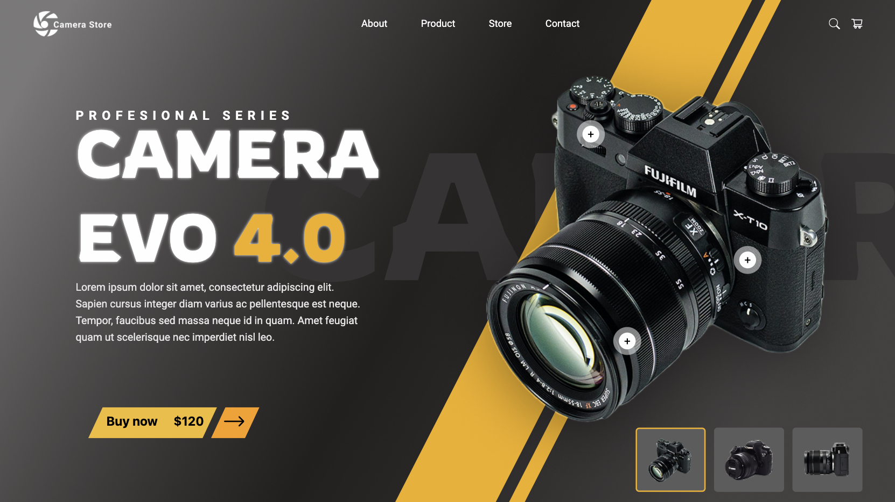
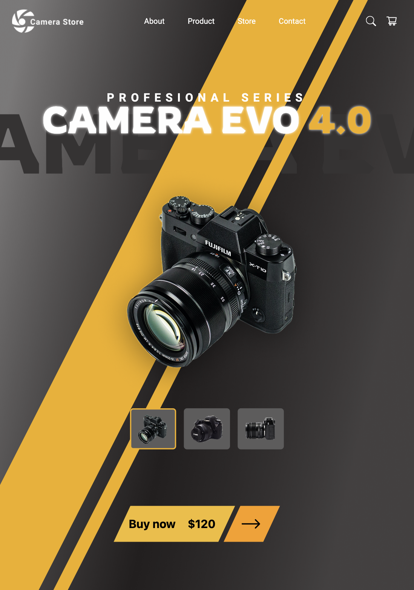
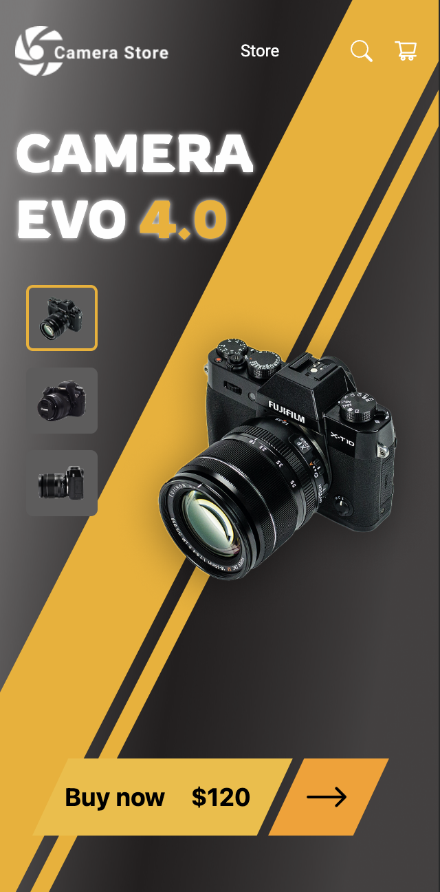

# Camera Store
* Desktop

* Tablet

* Mobile

Website de venda de câmeras do tipo landing page, com responsividade entre desktop, tablet e mobile, realizado como ativadade do SAS - Situação de Aprendizagem Somativa.
Os protótipos utilizados estão no link a seguir:

https://www.figma.com/design/JFpGgKfNQ0UtZCy09APcRl/lima-atividade-camera--Copy-?node-id=0-1&t=MHveSn7CG6KPXYU6-1

## Como visualizar o projeto
Para visualizar o site, basta clicar no link abaixo:

https://znathan2303.github.io/camera-store_camera-evo/

## Tecnologias
* HTML
* Framework Tailwind CSS

## Autor
[Nathan da Silva Costa](<https://www.linkedin.com/in/nathandasilvacosta/>)